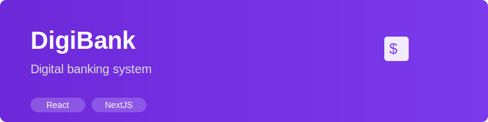

<div align="center">
  
</div>

# DigiBank

Sistema bancário digital moderno e intuitivo desenvolvido com React e Node.js.

## 🚀 Instalação Rápida

### Pré-requisitos

- Node.js
- npm ou yarn
- MySQL

### 1. Clone o repositório

```bash
git clone [url-do-seu-repositorio]
cd digibank
```

### 2. Instalação das dependências

#### Frontend
```bash
cd frontend
npm install
# ou
yarn install
```

#### API
```bash
cd api
npm install
# ou
yarn install
```

### 3. Configuração do Banco de Dados

1. Acesse a pasta `api/config`
2. Localize o arquivo `readme.md` com o script SQL
3. Execute o script no seu servidor MySQL local

### 4. Configuração do Ambiente

Na pasta da API, configure as variáveis de ambiente:

```bash
cp .env.example .env
```

Edite o arquivo `.env` com suas configurações locais:
```env
DB_HOST=localhost
DB_USER=seu_usuario
DB_PASS=sua_senha
DB_NAME=digibank
```

### 5. Iniciando as Aplicações

#### API
```bash
cd api
npm start
```

#### Frontend
```bash
cd frontend
npm run dev
```

### 6. Acessando o Sistema

- API: [http://localhost:3001](http://localhost:3001)
- Frontend: [http://localhost:3000](http://localhost:3000)

## 🛠️ Tecnologias Utilizadas

- React
- Node.js
- MySQL
- Express

## 📝 Licença

Este projeto está sob a licença MIT. Veja o arquivo [LICENSE](LICENSE) para mais detalhes.

## 👨‍💻 Autor

Seu Nome - [Seu GitHub](https://github.com/seu-usuario)